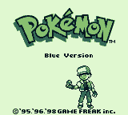
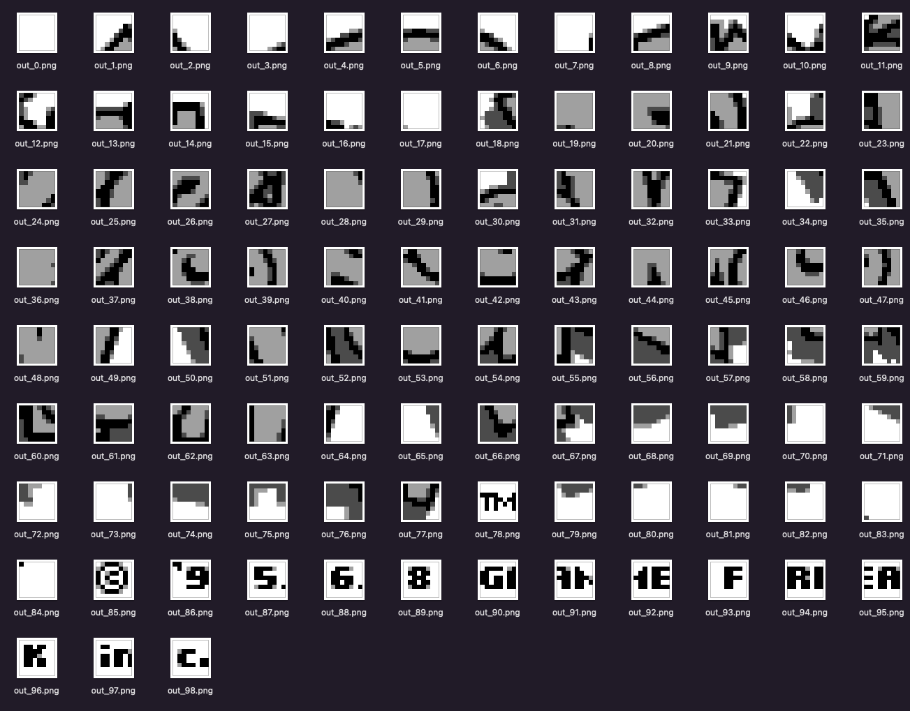

# GBGraphics

I always wanted to re-create my favorite retro-games. To do that, I need their graphics, but I am no designer nor I am interested in downloaded illegal material (such as rom and sprites). What if I could extract the graphics from my own personal Gameboy cartridge?

1. Takes a binary file as an input (i.e. gameboy rom) and parses a given screenshot (taken from an emulator).
2. This tool will create individual 8x8 images, decode their DMG color palete and convert them back to 2BPP format.
3. Then, it will search byte by byte through the binary file (i.e. gameboy rom) to find any of these 2BPP tiles.
4. If it finds one, it will convert this specific block of 2BPP code back to a PNG image and save it locally.
5. It will continue until there are no more 8x8 images left.

In this way, I can (programmtically) extract the original 8x8 tiles used for a specific scene of my Gameboy game.
So, later I can assemble these using a TileMap software or something like [Aseprite](https://www.aseprite.org/)

## How it works

### Get a ROM file

First step is to dump a Rom file (e.g. `game.gb`) from your GameBoy physical cartridge. To do that you a need a cartridge reader, such as [Sanni's Open Source cardreader](https://github.com/sanni/cartreader). There are other devices, dedicated to dumping Gameboy cards such as [GBxCart RW v1.4 Pro](https://retrogamerepairshop.com/products/gbxcart-rw-gameboy-gbc-gba-cart-reader-writer-flasher).

### Take a screenshot

Launch your favorite Gameboy emulator and start playing the game until you find the scene your are interested in ripping its graphics.
The requirements for a proper screenshot:

1. image type: ARGB
2. resolution: 160×144 pixels (it's the native GameBoy res)

NOTE: It's very important to take a screenshot with these specifications, otherwise this tool won't work! Read [Gameboy 2BPP Graphics Format](https://www.huderlem.com/demos/gameboy2bpp.html) article by [Huderlem](https://www.huderlem.com/) for further details.

In my case, I am using my modified version of [GoBoy](https://github.com/drpaneas/goboy) emulator.
Here's the instruction for you, to follow my example:

```bash
# Clone my fork
git clone https://github.com/drpaneas/goboy; cd goboy

# Build it (you need to have Go installed)
go build -o goboy cmd/goboy/main.go

# Run it against your Rom (e.g. pokemon.gb)
./goboy -dmg pokemon.gb
```

The game will start playing in a tiny bordeless window!
Press `t` to take a screenshot. It will be saved locally with `screenshot.png` filename.

## Usage

```bash
GBGraphics - extract graphics from Gameboy ROM using a screenshot
git commit 6e5708bd3fe042b3f035d8182edbe1f7b61a8e14
Usage: gbgraphics --img <SCREENSHOT> [--output <FILE>] ROM

    Positional arguments:
    ROM                    Path to the ROM file

    Options:
    --img <SCREENSHOT>     path of in-game screenshot
    --output <FILE>        output file [default: out.png]
    --help, -h             display this help and exit
    --version              display version and exit
```

### Example

```bash
$ ./gbgraphics --img screen.png pokemon.gb
```

Output:

```
'00 00 00 00 00 00 00 00 00 00 00 00 00 00 00 00' (Found at location 0xBE) converted to 'out_0.png'
[... omitted for brevity ...]
'00 00 60 60 0F 0E 6D 6D 6D 6D 6D 6D 00 00 00 00' (Found at location 0x121D8) converted to 'out_97.png'
'00 00 00 00 78 38 60 60 63 63 7B 3B 00 00 00 00' (Found at location 0x121E8) converted to 'out_98.png'
```

Screenshot (`screen.png`) used in this example, taken from my goboy emulator fork:



And the unique tiles extracted from this one:



Cool, eh?